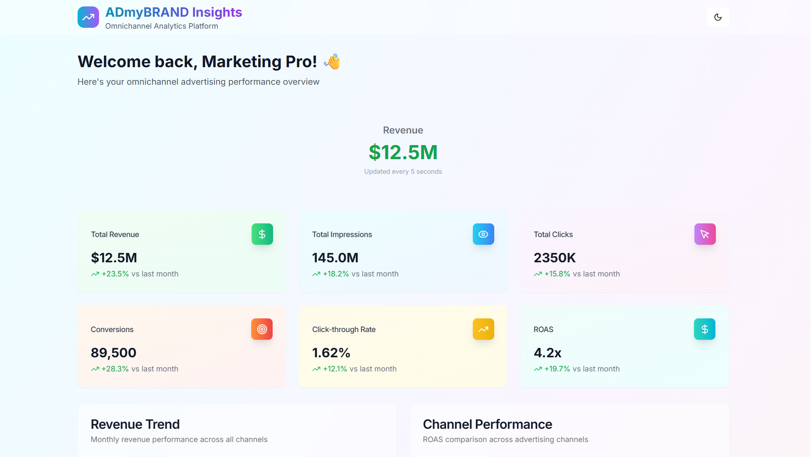

# 📊 Admybrand Insights Dashboard

A sleek, data-rich, and responsive analytics dashboard built using **Next.js**, **Tailwind CSS**, and **ShadCN UI**, with powerful features like real-time updates, export functionality (PDF/CSV), and advanced filtering — all rapidly built using AI assistance.



---

## 🚀 Live Demo

👉 [View Demo on Vercel](https://your-vercel-app-url.vercel.app/)  
👉 [GitHub Repo](https://github.com/yourusername/admybrand-insights-dashboard)

---

## 🧠 Features

- ✅ **Real-Time Revenue Chart** (auto-updating)
- ✅ **Export to PDF / CSV**
- ✅ **Advanced Filters with Date Ranges**
- ✅ **Modern Table with Skeleton Loaders**
- ✅ **Fully Responsive UI**
- ✅ **ShadCN Components + Tailwind Theming**
- ✅ **Dark Mode Compatible**

---

## 💻 Tech Stack

- **Frontend**: Next.js 13 (App Router), React 18, Tailwind CSS
- **UI Kit**: [ShadCN UI](https://ui.shadcn.com/)
- **Charting**: Recharts
- **PDF Export**: jsPDF + autoTable
- **CSV Export**: json2csv
- **Deployment**: Vercel

---

## 📂 Project Structure

```plaintext
app/
│
├── page.tsx                 # Entry point for dashboard UI
│
├── components/
│   ├── RealTimeRevenue.tsx  # Real-time revenue component
│   ├── DataTable.tsx        # Data table with CSV/PDF export
│   └── ui/
│       └── chart.tsx        # Custom chart components for graphs
│
├── lib/
│   └── utils.ts             # Utility functions (if any)
│
public/                      # Static assets (images, logos)
styles/                      # Global and modular CSS styles

```


---

## 🧠 AI Usage Report

See [`AI_USAGE_REPORT.md`](./AI_USAGE_REPORT.md) for details on AI tools, prompts, and manual vs AI split.

---

## 📦 Installation & Running Locally

```bash
# Clone the repository
git clone https://github.com/yourusername/admybrand-insights-dashboard.git
cd admybrand-insights-dashboard

# Install dependencies
npm install

# Run in development mode
npm run dev

